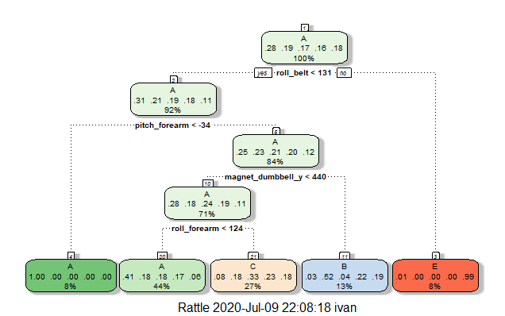

## Project
This is a course project for applying machine learning algorithm to the 20 test cases available in the test data described below.  With the machine learning algorithm, predict the outcome of the datasets.

The submission includes a github link:

https://github.com/ivanchow/pmlwk4prj

where the Project.Rmd file and data files are kept.

## Background

Using devices such as Jawbone Up, Nike FuelBand, and Fitbit it is now possible to collect a large amount of data about personal activity relatively inexpensively. These type of devices are part of the quantified self movement – a group of enthusiasts who take measurements about themselves regularly to improve their health, to find patterns in their behavior, or because they are tech geeks. One thing that people regularly do is quantify how much of a particular activity they do, but they rarely quantify how well they do it. They were asked to perform barbell lifts correctly and incorrectly in 5 different ways. More information is available from the website here: http://groupware.les.inf.puc-rio.br/har (see the section on the Weight Lifting Exercise Dataset).

## Data

The training data for this project are available here:

https://d396qusza40orc.cloudfront.net/predmachlearn/pml-training.csv

The test data are available here:

https://d396qusza40orc.cloudfront.net/predmachlearn/pml-testing.csv

The data for this project come from this source: http://groupware.les.inf.puc-rio.br/har.

(see the section on the Weight Lifting Exercise Dataset).

Credits to: 
Velloso, E.; Bulling, A.; Gellersen, H.; Ugulino, W.; Fuks, H. Qualitative Activity Recognition of Weight Lifting Exercises. Proceedings of 4th International Conference in Cooperation with SIGCHI (Augmented Human ’13) . Stuttgart, Germany: ACM SIGCHI, 2013

### Goal
The goal is to use data from accelerometers on the belt, forearm, arm, and dumbell of 6 participants and to predict the manner in which they did the exercise, which is the "classe" variable in the training set. 

## Import Library 

```{r, warning=FALSE, message=FALSE}
library(ggplot2)
library(lattice)
library(caret)
library(randomForest)
library(rpart)
library(gbm)
library(tibble)
library(bitops)
library(rattle)

```


## Load and Clean Up Data
Load the csv files and remove data with N/A and columns which do not impact 'classe'.

```{r, eval=FALSE, echo=TRUE}

training <- read.csv("pml-training.csv", na.strings=c("NA","#DIV/0!",""), header = TRUE)
testing <- read.csv("pml-testing.csv", na.strings=c("NA","#DIV/0!",""), header = TRUE)

training <- training[, -c(1:7)]
testing <- testing[, -c(1:7)]

```

## Create Traing and Testing Data 
With large amount of data, we can create 80% training and 20% test sets data.
Also, we remove the non-zero variance columns from the dataset to help the model fitting.

```{r, eval=FALSE, echo=TRUE}
training_index <- createDataPartition(training$classe, p = 0.8, list = FALSE)
train_data <- training[training_index, ]
test_data <- training[-training_index, ]
near_zero <- nearZeroVar(train_data)
train_data <- train_data[, -near_zero]
test_data  <- test_data[, -near_zero]
clean_na <- colSums(is.na(train_data))<0.97*nrow(train_data)
test_data <- test_data[, clean_na]
train_data <- train_data[, clean_na]
dim(train_data)
```

## Building Models with Different Algorithms
Since we have the clean training and testing data set, we try different algorithm to creat different models for predictions.

### Random Forest
```{r, eval=FALSE, echo=TRUE}
set.seed(111)
rf_trControl <- trainControl(method="cv",  number=3, verboseIter=FALSE)
rf_model <- train(classe ~ ., data=train_data, method="rf")
rf_model$finalModel
```

```{r, eval=FALSE, echo=TRUE}
##
## Call:
## randomForest(x = x, y = y, mtry = param$mtry) 
##                Type of random forest: classification
##                      Number of trees: 500
## No. of variables tried at each split: 27
## 
##         OOB estimate of  error rate: 0.71%
## Confusion matrix:
##      A    B    C    D    E class.error
## A 3900    3    2    0    1 0.001536098
## B   16 2635    7    0    0 0.008653123
## C    0   14 2377    5    0 0.007929883
## D    1    1   30 2216    4 0.015985790
## E    0    2    3    9 2511 0.005544554
```

### Gradient Boosting Machine (GBM)
```{r, eval=FALSE, echo=TRUE}
set.seed(111)
gbm_trControl <- trainControl(method = "repeatedcv", number = 5, repeats = 1)
gbm_model  <- train(classe ~ ., data=train_data, method = "gbm", trControl = gbm_trControl, verbose = FALSE)
gbm_model$finalModel
```

```{r, eval=FALSE, echo=TRUE}
## A gradient boosted model with multinomial loss function.
## 150 iterations were performed.
## There were 52 predictors of which 52 had non-zero influence.
```

```{r, eval=FALSE, echo=TRUE}
print(gbm_model)
```

```{r, eval=FALSE, echo=TRUE}
## Stochastic Gradient Boosting 
## 
## 13737 samples
##    52 predictor
##     5 classes: 'A', 'B', 'C', 'D', 'E' 
## 
## No pre-processing
## Resampling: Bootstrapped (25 reps) 
## Summary of sample sizes: 13737, 13737, 13737, 13737, 13737, 13737, ... 
## Resampling results across tuning parameters:
## 
##   interaction.depth  n.trees  Accuracy   Kappa    
##   1                   50      0.7522087  0.6859218
##   1                  100      0.8155380  0.7665049
##   1                  150      0.8503749  0.8106443
##   2                   50      0.8514946  0.8118291
##   2                  100      0.9029528  0.8771836
##   2                  150      0.9273893  0.9081244
##   3                   50      0.8926803  0.8641341
##   3                  100      0.9377692  0.9212615
##   3                  150      0.9568996  0.9454787
## 
## Tuning parameter 'shrinkage' was held constant at a value of 0.1
## Tuning
##  parameter 'n.minobsinnode' was held constant at a value of 10
## Accuracy was used to select the optimal model using the largest value.
## The final values used for the model were n.trees = 150, interaction.depth = 3, shrinkage
##  = 0.1 and n.minobsinnode = 10.
```
 

### Decision Tree
```{r, eval=FALSE, echo=TRUE}
set.seed(111)
rpart_model <- train(classe ~ ., data=train_data, method="rpart")
fancyRpartPlot(rpart_model$finalModel)
```
<center>

</center>

## Validation with Prediction on the test set
Use the model we built for each algorithm, we apply each model to the test_data, 20% split from the pml-training.csv data set and evaluate the accuracy.

### Random Forest
```{r, eval=FALSE, echo=TRUE}
rf_predict <- predict(rf_model, newdata=test_data)
rf_cm <- confusionMatrix(factor(rf_predict), factor(test_data$classe))
rf_cm
```

```{r, eval=FALSE, echo=TRUE}
## Confusion Matrix and Statistics
## 
##           Reference
## Prediction    A    B    C    D    E
##          A 1116    2    0    0    0
##          B    0  757    3    0    0
##          C    0    0  681    0    0
##          D    0    0    0  643    2
##          E    0    0    0    0  719
## 
## Overall Statistics
##                                           
##                Accuracy : 0.9982          
##                  95% CI : (0.9963, 0.9993)
##     No Information Rate : 0.2845          
##     P-Value [Acc > NIR] : < 2.2e-16       
##                                           
##                   Kappa : 0.9977          
##                                           
##  Mcnemar's Test P-Value : NA              
## 
## Statistics by Class:
## 
##                      Class: A Class: B Class: C Class: D Class: E
## Sensitivity            1.0000   0.9974   0.9956   1.0000   0.9972
## Specificity            0.9993   0.9991   1.0000   0.9994   1.0000
## Pos Pred Value         0.9982   0.9961   1.0000   0.9969   1.0000
## Neg Pred Value         1.0000   0.9994   0.9991   1.0000   0.9994
## Prevalence             0.2845   0.1935   0.1744   0.1639   0.1838
## Detection Rate         0.2845   0.1930   0.1736   0.1639   0.1833
## Detection Prevalence   0.2850   0.1937   0.1736   0.1644   0.1833
## Balanced Accuracy      0.9996   0.9982   0.9978   0.9997   0.9986
```
Accuracy of applying this model to the test_datat (validation) is 99.82%

### GBM
```{r, eval=FALSE, echo=TRUE}
gbm_predict <- predict(gbm_model, newdata=test_data)
gbm_cm <- confusionMatrix(factor(gbm_predict), factor(test_data$classe))
gbm_cm
```

```{r, eval=FALSE, echo=TRUE}
## Confusion Matrix and Statistics
##
##          Reference
## Prediction    A    B    C    D    E
##          A 1105   13    0    1    0
##          B    8  731   18    1    9
##          C    1   15  661   25   10
##          D    2    0    3  616    9
##          E    0    0    2    0  693
## 
## Overall Statistics
##                                           
##                Accuracy : 0.9702          
##                  95% CI : (0.9644, 0.9753)
##     No Information Rate : 0.2845          
##     P-Value [Acc > NIR] : < 2.2e-16       
##                                           
##                   Kappa : 0.9623          
##                                           
##  Mcnemar's Test P-Value : NA              
## 
## Statistics by Class:
## 
##                      Class: A Class: B Class: C Class: D Class: E
## Sensitivity            0.9901   0.9631   0.9664   0.9580   0.9612
## Specificity            0.9950   0.9886   0.9843   0.9957   0.9994
## Pos Pred Value         0.9875   0.9531   0.9284   0.9778   0.9971
## Neg Pred Value         0.9961   0.9911   0.9928   0.9918   0.9913
## Prevalence             0.2845   0.1935   0.1744   0.1639   0.1838
## Detection Rate         0.2817   0.1863   0.1685   0.1570   0.1767
## Detection Prevalence   0.2852   0.1955   0.1815   0.1606   0.1772
## Balanced Accuracy      0.9926   0.9759   0.9753   0.9769   0.9803
```
Accuracy of applying this model to the test_datat (validation) is 97.02%

### Decision Tree
```{r, eval=FALSE, echo=TRUE}
rpart_predict <- predict(rpart_model, newdata=test_data)
rpart_cm <- confusionMatrix(factor(rpart_predict), factor(test_data$classe))
rpart_cm
```

```{r, eval=FALSE, echo=TRUE}
## Confusion Matrix and Statistics
## 
##           Reference
## Prediction    A    B    C    D    E
##          A 1040  317  305  284  103
##          B   20  253   21  125  105
##          C   53  189  358  234  193
##          D    0    0    0    0    0
##          E    3    0    0    0  320
## 
## Overall Statistics
##                                           
##                Accuracy : 0.5024          
##                  95% CI : (0.4867, 0.5182)
##     No Information Rate : 0.2845          
##     P-Value [Acc > NIR] : < 2.2e-16       
##                                           
##                   Kappa : 0.3494          
##                                           
##  Mcnemar's Test P-Value : NA              
## 
## Statistics by Class:
## 
##                      Class: A Class: B Class: C Class: D Class: E
## Sensitivity            0.9319  0.33333  0.52339   0.0000  0.44383
## Specificity            0.6405  0.91435  0.79345   1.0000  0.99906
## Pos Pred Value         0.5076  0.48282  0.34859      NaN  0.99071
## Neg Pred Value         0.9594  0.85113  0.88743   0.8361  0.88861
## Prevalence             0.2845  0.19347  0.17436   0.1639  0.18379
## Detection Rate         0.2651  0.06449  0.09126   0.0000  0.08157
## Detection Prevalence   0.5223  0.13357  0.26179   0.0000  0.08233
## Balanced Accuracy      0.7862  0.62384  0.65842   0.5000  0.72145
```
Accuracy of applying this model to the test_datat (validation) is 50.24%

## Conclusion and Applying Model to Testing Data
Among the three, Random Forest model provides the best fit to the testing/validation data with accuracy of 99.82%.

Hence, we use the model built with Random Forest Algorithm to predict the new data from the pml-testing.csv.

```{r, eval=FALSE, echo=TRUE}
prediction_testing_data <- predict(rf_model, newdata=testing)
prediction_testing_data
```

```{r, eval=FALSE, echo=TRUE}
##  [1] B A B A A E D B A A B C B A E E A B B B
## Levels: A B C D E
```


